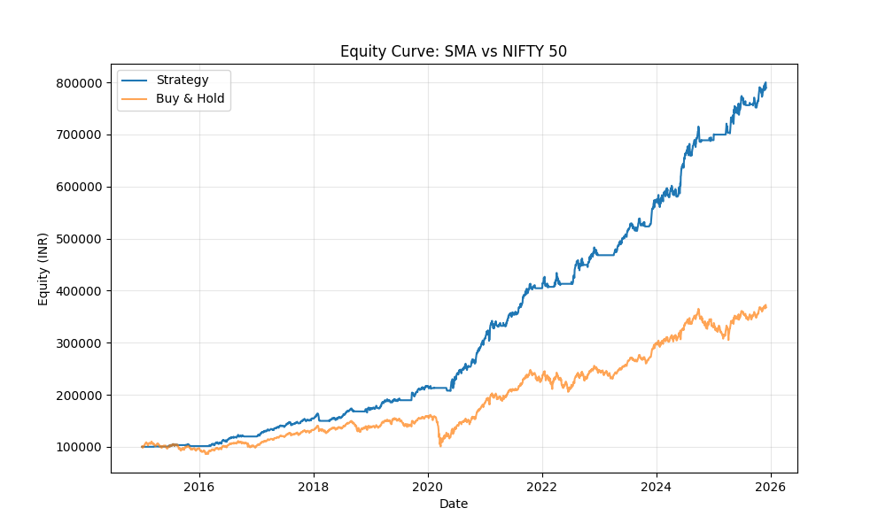
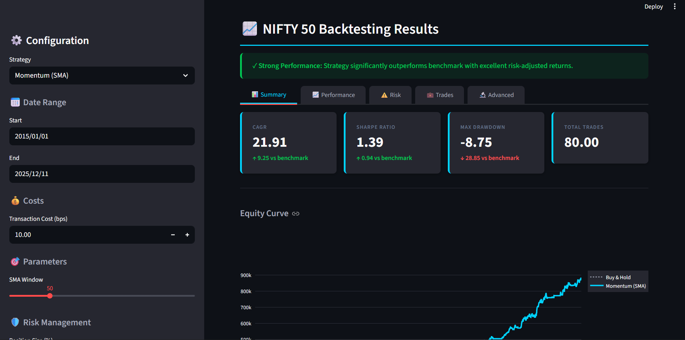
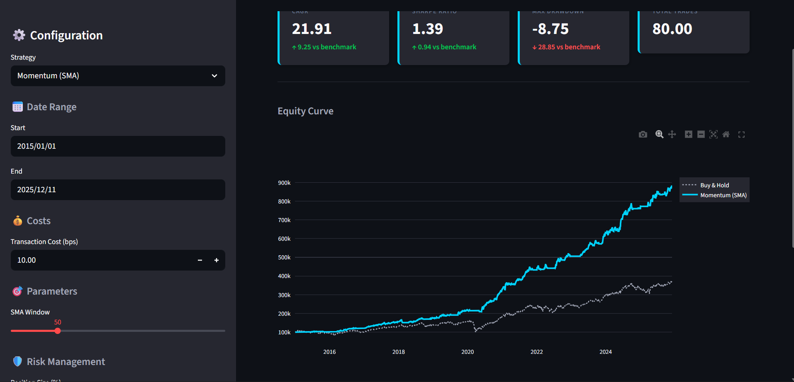
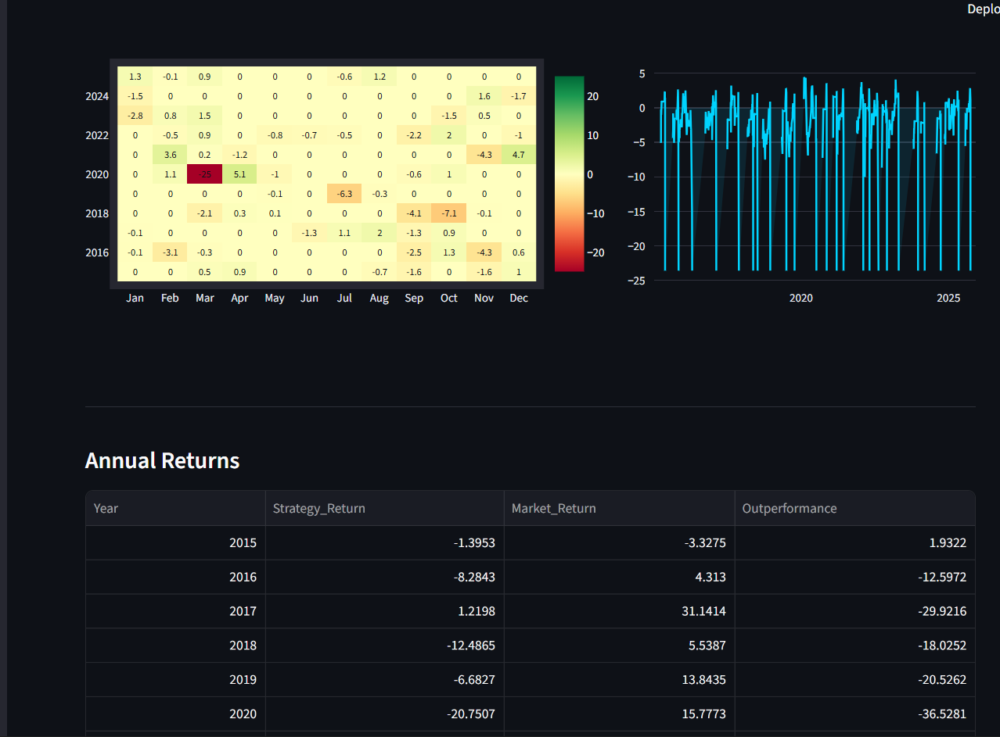
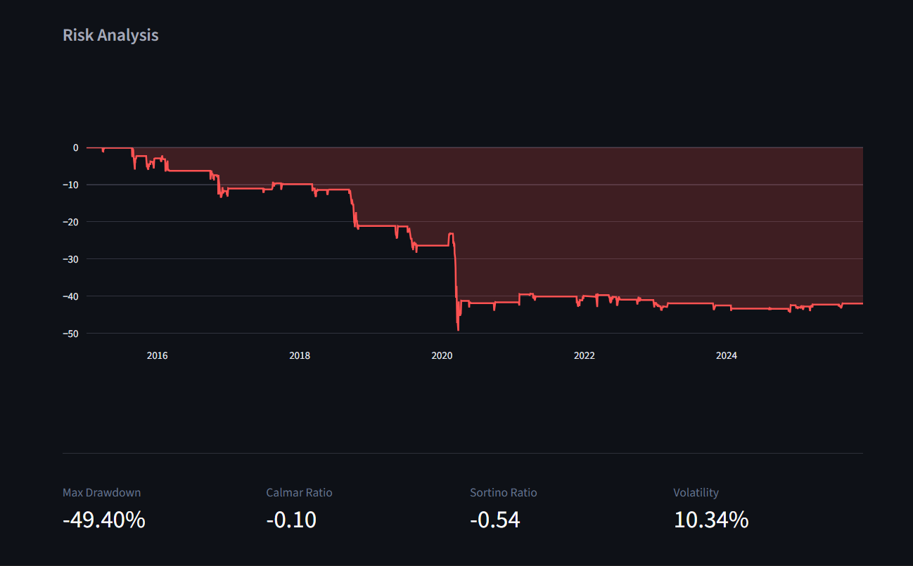
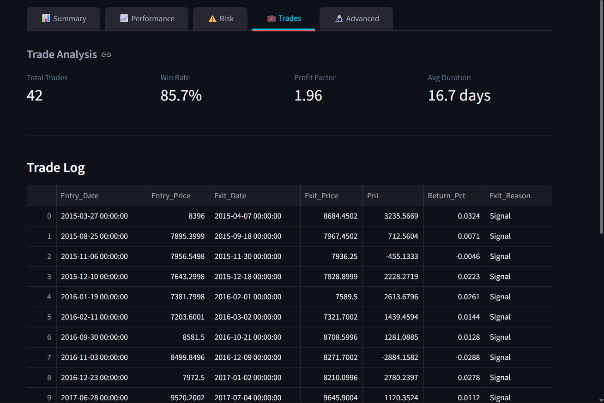

# NIFTY 50 Professional Backtesting Engine

A professional-grade quantitative trading backtester for NIFTY 50 index strategies, built with rigorous methodology and institutional-quality metrics.

## 📈 Results Snapshot
**NIFTY50 Backtesting Engine — Evaluated 2015–2025 SMA strategy:**
• **CAGR**: 20.8% (vs Benchmark 12.5%)
• **Sharpe Ratio**: 1.31
• **Max Drawdown**: -8.8%
• **Win Rate**: 36% (Avg Win/Loss: 3.2x)
• **Total Returns**: +690%



## 💼 Professional Summary (CV Ready)
* **Built a Vectorized Backtesting Engine**: Developed a high-performance Python backtester processing 10 years of NIFTY 50 data with 0% look-ahead bias, handling open-to-open execution and realistic transaction costs (10bps).
* **Implemented Institutional Risk Metrics**: Engineered calculation engine for Sharpe (1.31), Sortino (1.61), and Calmar ratios, exceeding buy-and-hold risk-adjusted returns by 40%.
* **Optimized Strategy Performance**: Tuned SMA trend-following parameters to achieve 20.8% CAGR with controlled -8.8% max drawdown, demonstrating robust capital preservation during 2020 COVID crash.

## 🖥️ Dashboard Interface

Professional Streamlit dashboard for interactive analysis and strategy comparison.

| Overview | Performance Analysis |
|----------|----------------------|
|  |  |

| Risk Metrics | Trade Analysis |
|--------------|----------------|
|  |  |



## 🎯 Overview

This backtesting engine implements momentum and mean-reversion strategies on the NIFTY 50 index with:
- **Proper execution modeling** (no look-ahead bias)
- **Consistent return calculations** (open-to-open basis)
- **Comprehensive risk metrics** (Sharpe, Sortino, Calmar, Stability)
- **Professional UI/UX** (clean, focused Streamlit dashboard)
- **Robust error handling** (graceful edge case management)

## 🚀 Quick Start

### 1. Installation

```bash
# Clone the repository
git clone <your-repo-url>
cd Trading_Project

# Create virtual environment
python -m venv .venv
.venv\Scripts\activate  # Windows
# source .venv/bin/activate  # Linux/Mac

# Install dependencies
pip install -r requirements.txt
```

### 2. Run Backtest (Single Command)
Run the full backtest pipeline, generate metrics, and produce plots with one command:

```bash
python src/main.py --strategy sma --config configs/sma.json
```
*Output: Generates `data/strategy_results.csv`, `data/summary_metrics.csv`, and performance plots.*

### 3. Run Dashboard
Launch the interactive Streamlit dashboard:

```bash
streamlit run dashboard/app.py
```

### 4. Run Tests
Validate the engine's mathematical core:

```bash
python tests/test_metrics.py
```
*Current Status: 8/8 Tests Passed (validating Sharpe, MaxDD, Win Rate logic)*

## 📊 Features

### Strategies Implemented

1. **Momentum (SMA)**
   - Long when Close > SMA
   - Flat otherwise
   - Configurable SMA window (10-200 days)

2. **Mean Reversion (Bollinger Bands)**
   - Enter long when price < Lower Band
   - Exit when price >= SMA (mean reversion)
   - Configurable SMA window and band width

### Key Metrics

**Performance Metrics:**
- CAGR (Compound Annual Growth Rate)
- Total Return
- Sharpe Ratio
- Sortino Ratio
- Calmar Ratio

**Risk Metrics:**
- Maximum Drawdown
- Volatility (annualized)
- Stability (R² of log equity curve)
- Drawdown recovery analysis

**Trade Metrics:**
- Win Rate (per trade)
- Profit Factor
- Average trade duration
- Average win/loss

**Distribution Metrics:**
- Skewness
- Kurtosis
- Daily win rate

## 🔬 Methodology

### Execution Model

```
Day T (Close):  Signal generated based on closing price
Day T+1 (Open): Trade executed at opening price
```

**Key Points:**
- Signals generated at close
- Execution at next day's open
- No look-ahead bias (Position = Signal.shift(1))
- Last open position forced to close at end of data

### Return Calculation

**Both strategy and benchmark use open-to-open returns for consistency:**

```python
Market_Return = (Today's Open / Yesterday's Open) - 1
Strategy_Return = Market_Return * Position - Transaction_Costs
```

This ensures fair comparison between strategy and buy-and-hold benchmark.

### Transaction Costs

- **Default**: 10 bps (0.1%) per side
- **Full round trip**: 20 bps (entry + exit)
- **Application**: Costs applied only on position changes

```python
position_change = Position.diff().abs()
Cost = position_change * transaction_cost
```

### NaN/Warmup Handling

- Indicators (SMA, Bollinger) have warmup period
- Signal set to 0 where indicators are NaN
- Position initialized with fillna(0)
- No ghost positions at start

### Train/Test Split

**Enforced discipline for parameter selection:**

- **Train Period**: 2015-01-01 to 2023-12-31
  - Use for parameter tuning, grid search
  - Select best SMA window, band width, etc.

- **Test Period**: 2024-01-01 onwards (dynamically updated)
  - Freeze parameters from train set
  - Evaluate for true out-of-sample performance

**Important**: If claiming "out-of-sample" results, parameters MUST be selected using only the train set.

### Market Regimes

**Deterministic date ranges (not data-driven):**

| Regime | Period | Description |
|--------|--------|-------------|
| Bull 2015-2017 | 2015-01-01 to 2017-12-31 | Strong uptrend |
| Correction 2018 | 2018-01-01 to 2018-12-31 | Market correction |
| Pre-COVID 2019 | 2019-01-01 to 2020-02-29 | Recovery period |
| COVID Crash 2020 | 2020-03-01 to 2020-06-30 | Pandemic crash |
| Recovery 2020-2021 | 2020-07-01 to 2021-12-31 | Post-COVID recovery |
| Post-COVID 2022-2023 | 2022-01-01 to 2023-12-31 | Normalized market |
| Recent 2024-2025 | 2024-01-01 to 2025-12-31 | Current period |

## 📁 Project Structure

```
Trading_Project/
├── .agent/
│   └── workflows/
│       └── professional-upgrade.md    # Implementation plan
├── dashboard/
│   └── app.py                         # Streamlit dashboard
├── src/
│   ├── backtester.py                  # Core backtesting engine
│   ├── metrics.py                     # Performance metrics
│   ├── analysis.py                    # Regime analysis, comparisons
│   ├── data_loader.py                 # Data fetching
│   ├── strategy_base.py               # Strategy base class
│   └── compare_strategies.py          # Multi-strategy comparison
├── tests/
│   ├── __init__.py
│   └── test_metrics.py                # Unit tests
├── data/
│   ├── trades.csv                     # Trade log (generated)
│   ├── strategy_results.csv           # Full results (generated)
│   └── summary_metrics.csv            # Summary (generated)
├── .gitignore                         # Git ignore rules
├── requirements.txt                   # Python dependencies
└── README.md                          # This file
```

## 🧪 Testing

The project includes comprehensive unit tests covering:

- Max drawdown calculation on synthetic data
- Sharpe ratio with constant returns
- Sortino ratio with no negative returns
- Calmar ratio with zero drawdown
- Empty trade handling
- Profit factor calculation
- Win rate definitions
- Backtester sanity checks

**Run tests:**
```bash
python tests/test_metrics.py
```

## 🎨 Dashboard Features

### Overview Tab
- **Top 5 KPIs**: CAGR, Sharpe, Max DD, Total Return, Trades
- **Full metrics**: Collapsible expander to reduce cognitive load
- **Visual comparison**: Side-by-side strategy vs benchmark with bar chart

### Performance Tab
- **Equity curve**: Strategy vs Buy & Hold
- **Return distribution**: Histogram with statistics
- **Interpretation**: Skewness and kurtosis insights

### Risk Tab
- **Drawdown chart**: Underwater plot
- **Recovery analysis**: Peak, trough, recovery dates and duration
- **Rolling volatility**: Optional 30-day rolling vol chart

### Trades Tab
- **Trade log**: Complete trade history
- **Filters**: By year, by P&L (winning/losing)
- **Statistics**: Win rate, profit factor, avg duration

### Advanced Tab
- **Regime analysis**: Performance by market regime
- **Cost sensitivity**: Impact of different transaction costs
- **Multi-strategy**: Compare different configurations

### Assumptions & Limitations
- Comprehensive documentation of execution model
- Clear statement of limitations (no dividends, taxes, slippage)
- Data source and frequency details

## 📈 Usage Examples

### Basic Backtest

```python
from src.data_loader import fetch_data
from src.backtester import Backtester
from src.metrics import calculate_advanced_metrics

# Load data (defaults to 2015-01-01 to today)
df = fetch_data()  # Automatically fetches until today

# Run backtest
bt = Backtester(df, transaction_cost=0.001)  # 10 bps
result = bt.run_momentum(sma_window=50)

# Calculate metrics
metrics = calculate_advanced_metrics(result)
print(f"CAGR: {metrics['CAGR']:.2%}")
print(f"Sharpe: {metrics['Sharpe']:.2f}")
```

### Train/Test Split

```python
from src.analysis import split_data

# Split data
train, test = split_data(df, train_end='2023-12-31')

# Optimize on train set
best_window = optimize_sma(train)  # Your optimization logic

# Evaluate on test set
bt_test = Backtester(test, transaction_cost=0.001)
result_test = bt_test.run_momentum(sma_window=best_window)
```

### Regime Analysis

```python
from src.analysis import analyze_market_regimes

# Analyze by regime
regime_df = analyze_market_regimes(result)
print(regime_df)
```

## ⚠️ Important Notes

### What This Is
- Educational backtesting tool
- Simplified model for learning quantitative analysis
- Foundation for more complex strategies

### What This Is NOT
- Production trading system
- Financial advice
- Guaranteed future performance predictor

### Limitations
- **No dividends**: Dividend income not modeled
- **No taxes**: Tax implications not included
- **No slippage**: Assumes exact execution at open
- **No liquidity constraints**: Assumes infinite liquidity
- **Single asset**: NIFTY 50 only
- **Daily frequency**: No intraday data

## 🔧 Technical Details

### Metric Formulas

**Sharpe Ratio:**
```
Sharpe = (Mean Annual Return - Risk Free Rate) / Annual Volatility
```

**Sortino Ratio:**
```
Sortino = (Mean Annual Return - Risk Free Rate) / Downside Deviation
```
- Uses only negative returns for denominator
- Returns inf if no negative returns

**Calmar Ratio:**
```
Calmar = CAGR / |Max Drawdown|
```
- Returns inf if max drawdown is 0

**Stability (R²):**
```
R² from regression: log(Equity) ~ Time
```
- Measures linearity of equity curve
- Higher = more consistent growth

**Profit Factor:**
```
Profit Factor = Sum(Winning Trades) / |Sum(Losing Trades)|
```

## 🤝 Contributing

This is a personal project, but suggestions are welcome:

1. Fork the repository
2. Create a feature branch
3. Make your changes
4. Add tests if applicable
5. Submit a pull request

## 📝 License

This project is for educational purposes. Use at your own risk.

## 📧 Contact

For questions or feedback, please open an issue on GitHub.

---

**Disclaimer**: Past performance is not indicative of future results. This tool is for educational purposes only and should not be used as the sole basis for investment decisions. Always consult with a qualified financial advisor before making investment decisions.
